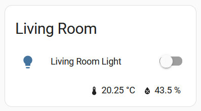

# lovelace-custom-sensors

This is a custom element for [Lovelace] (Home Assistant frontend) to display
sensors in a row. It is designed to be used in a footer of another card.

[Lovelace]: https://www.home-assistant.io/docs/frontend/

## Installation

1. Install [HACS](https://hacs.xyz).
1. In HACS, select _Frontend_.
1. Click on the menu (`⁝`) then select _Custom repositories_.
1. In the repository field, type this repository (`mook/lovelace-custom-sensors`)
   and select _Lovelace_ as the _Category_ in the dropdown, then click _Add_.
1. Click on the newly added repository, and the download button at the bottom
   right corner.
1. Click on _Download_ at the bottom right of the new page.

## Example

```yaml
# A normal entities card
type: entities
title: Living Room
entities:
  - light.living_room
footer:
  # ... With a custom footer
  type: custom:sensors-header-footer
  entities:
    - sensor.living_room_temperature
    - entity: sensor.living_room_humidity
      tap_action:
        type: more-info
```



## Configuration

| Key                 | Type   | Description                                        |
| ------------------- | ------ | -------------------------------------------------- |
| `type`              | string | Must be `custom:sensors-header-footer` to be used. |
| `entities`          | list   | A list of entity IDs or `entity` objects.          |
| `tap_action`        | object | Action on tap; see [Actions](#actions).            |
| `hold_action`       | object | Action on hold.                                    |
| `double_tap_action` | object | Action on double tap.                              |

> [!NOTE]
> To use the visual editor, `entities` must be a list of objects instead of
> strings.

### Entities

Each `entities` object can have the following:

| Key                 | Type   | Description                             |
| ------------------- | ------ | --------------------------------------- |
| `entity`            | string | The entity ID.                          |
| `tap_action`        | object | Action on tap; see [Actions](#actions). |
| `hold_action`       | object | Action on hold.                         |
| `double_tap_action` | object | Action on double tap.                   |

If the various `_action` keys are not set, the element-level configuration is
used. If it's not set at the element level, it defaults to `more-info`.

### Actions

It is possible to trigger actions on tap/hold/double-tap. Please see the Home
Assistant [Actions documentation] for the available configuration; note that
the `toggle` action is not available.

[Actions documentation]: https://www.home-assistant.io/dashboards/actions/

## Development

1. This depends on NodeJS & yarn:
   1. This was developed on NodeJS 20.
   1. Run `corepack enable` to have `yarn`.
1. Run `yarn dev` for a development server.
1. Add as an [extra Lovelace module]:

   ```yaml
   # configuration.yaml
   frontend:
     extra_module_url:
       - http://127.0.0.1:4173/custom-sensors.js
   ```

[extra Lovelace module]: https://www.home-assistant.io/integrations/frontend/#extra_module_url

## Thanks

Lots of code is copied from Lovelace directly.
